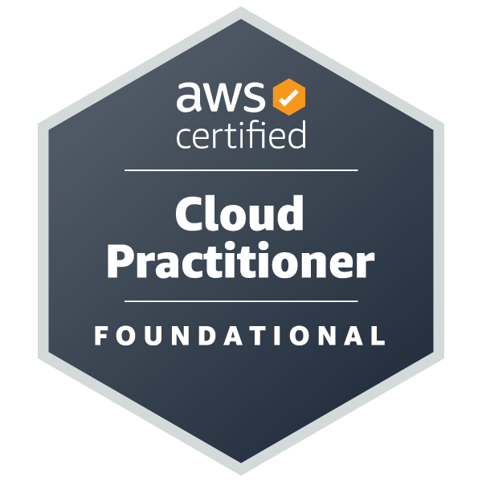
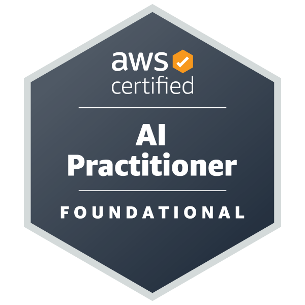
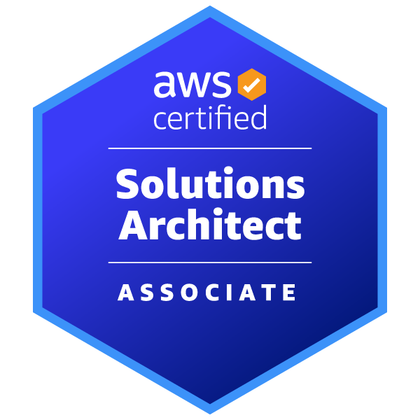

## Hi there 👋

<!--
**Hirost00/Hirost00** is a ✨ _special_ ✨ repository because its `README.md` (this file) appears on your GitHub profile.

Here are some ideas to get you started:

- 🔭 I’m currently working on ...
- 🌱 I’m currently learning ...
- 👯 I’m looking to collaborate on ...
- 🤔 I’m looking for help with ...
- 💬 Ask me about ...
- 📫 How to reach me: ...
- 😄 Pronouns: ...
- ⚡ Fun fact: ...
-->

<!-- 
 
    
    

 -->

 
  
  
  
  
  

## Languages and Tools

### Advanced
<!-- 実務レベルで使用でき、自信を持って開発できます -->
<!-- 言語: JS, TS | フロントエンド: React, HTML, CSS | バックエンド: Node.js | クラウド・インフラ: AWS, Docker, Terraform | バージョン管理・CI/CD: Git, GitHub, GitHub Actions | ビルドツール: Vite, Vitest, npm, pnpm, bun | エディタ: VSCode | その他: Markdown, Notion, Gmail, Twitter, Instagram, Apple, Windows -->

### Intermediate
<!-- 基本的な機能は使えますが、まだ学習中の部分があります -->
<!-- 言語: Python, Go, PHP | フロントエンド: Next.js, Astro, Svelte, Material UI, Tailwind CSS | クラウド: Azure | データベース・ORM: DynamoDB, Prisma | ビルドツール: yarn | シェル: PowerShell | エディタ: Emacs | その他: Discord Bots, Arduino, Selenium -->

### Basic
<!-- 触ったことがある、または学習を始めたばかりです -->
<!-- 言語: Java, Swift, Kotlin, Dart, Ruby, C, R, Rust | フロントエンド: jQuery | バックエンド: FastAPI, Django | データベース: PostgreSQL, MySQL, SQLite | クラウド・インフラ: Firebase, GCP, Nginx | ビルドツール: Gradle | OS: Linux, Ubuntu | エディタ: Vim, Android Studio | デザイン・開発ツール: Postman, Figma | その他: Replit, Anaconda, CMake -->

## Tech Certifications

